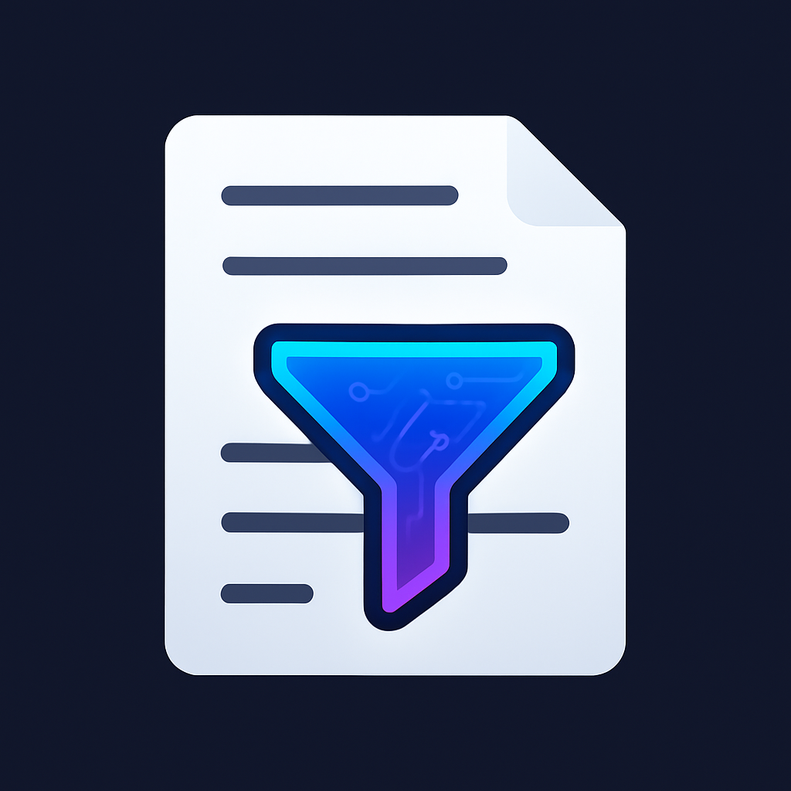
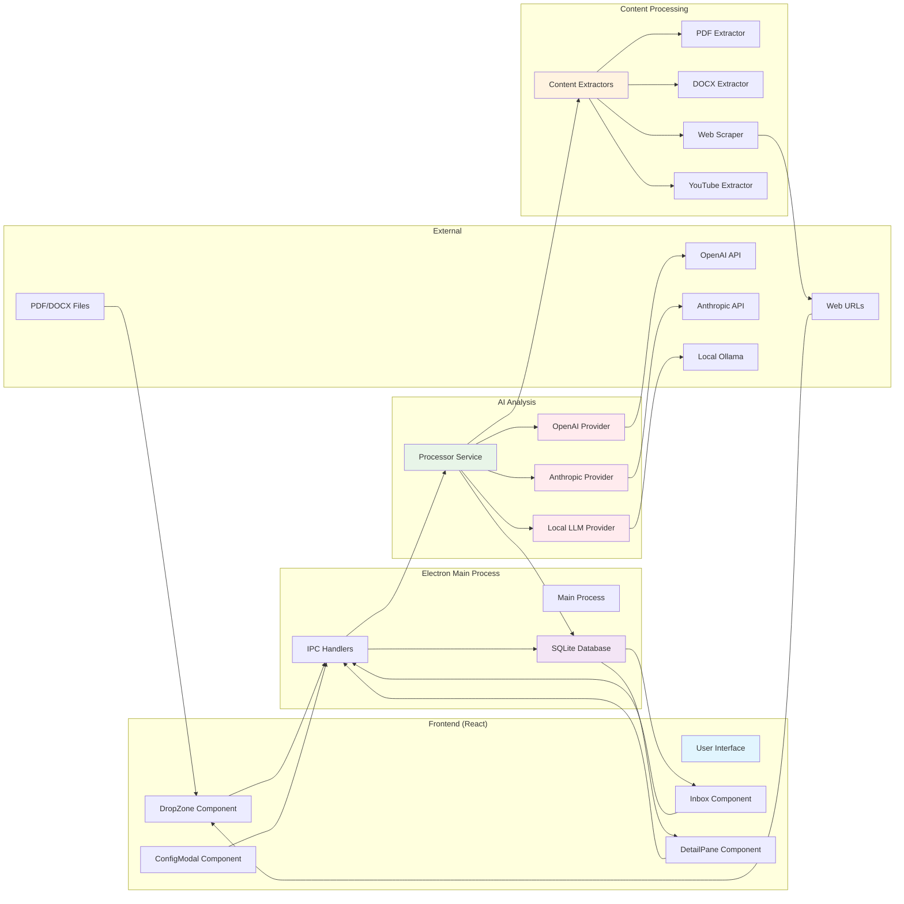

#  DocFilter


> **⚠️ DISCLAIMER: This software is provided "AS IS" without warranty of any kind. This is a personal project shared for educational purposes. Issues, pull requests, and support requests will not be processed or responded to. Use at your own risk.**

A desktop application for filtering and classifying documents, URLs, and multimedia using local or remote LLMs.

## Architecture

DocFilter implements a **three-tier architecture** within the Electron framework:

```
┌─────────────────┐    IPC     ┌─────────────────┐    SQL     ┌─────────────────┐
│ Presentation    │ ◄────────► │ Application     │ ◄────────► │ Data Tier       │
│ Tier            │            │ Tier            │            │                 │
│ - React UI      │            │ - Business      │            │ - SQLite DB     │
│ - User Input    │            │   Logic         │            │ - Config        │
│ - Display       │            │ - AI APIs       │            │ - Artifacts     │
│                 │            │ - File Extract  │            │                 │
└─────────────────┘            └─────────────────┘            └─────────────────┘
    Renderer Process              Main Process                   Persistent Storage
```

### Detailed Component Flow



## Features

- **Multi-format Support**: PDF, DOCX, TXT, URLs, YouTube videos
- **Browser Integration**: Send URLs directly from any browser with bookmarklet
- **Smart Token Management**: Configurable limits with intelligent content truncation
- **AI Analysis**: OpenAI, Anthropic, and local LLM support with visual status indicators
- **Large Document Handling**: Process massive PDFs while preserving full content
- **Local Storage**: All data stored locally (SQLite)
- **Drag & Drop**: Easy file ingestion
- **Configurable**: Customizable system prompts, providers, and token limits

## Getting Started

### Quick Start (Windows - Recommended)

1. **Install Dependencies**:
   ```cmd
   npm install
   ```

2. **Build the Application**:
   ```cmd
   npm run build
   ```

3. **Run the App**:
   ```cmd
   npx electron dist/main/src/main/main.js
   ```

### Development Setup (WSL2/Linux)

**Note**: Requires GUI libraries for Electron display.

1. **Install Dependencies**:
   ```bash
   npm install
   sudo apt install -y libnss3 libnspr4 libatk-bridge2.0-0 libdrm2 libxcomposite1 libxdamage1 libxrandr2 libgbm1 libxss1 libasound2
   ```

2. **Build and Run**:
   ```bash
   npm run build
   npm start
   ```

## Configuration

Before using the app, configure your LLM providers:

1. Click the "Config" button in the top-right
2. Set your system prompt (instructions for the AI)
3. **Configure Token Limit**: Set max tokens based on your model:
   - **GPT-3.5**: ~16,000 tokens
   - **GPT-4**: ~128,000 tokens  
   - **Claude**: ~200,000 tokens
   - **Local LLMs**: Varies by model
4. Configure at least one provider:
   - **OpenAI**: Add your API key (use `gpt-4o` for large documents)
   - **Anthropic**: Add your API key (use `claude-3-haiku-20240307` or newer)
   - **Local LLM**: Set endpoint (e.g., `http://localhost:11434/api/generate` for Ollama)

## Browser Integration

Send URLs directly from your browser to DocFilter:

### Setup Bookmarklet

1. **Copy this JavaScript code**:
   ```javascript
   javascript:(function(){window.open('docfilter://process?url=' + encodeURIComponent(window.location.href));})();
   ```

2. **Add to your browser**:
   - Create a new bookmark
   - Paste the code as the bookmark URL/location
   - Name it "Send to DocFilter"

### Usage

1. Navigate to any webpage (great for arXiv papers!)
2. Click your "Send to DocFilter" bookmark
3. Browser prompts to open DocFilter (allow and remember choice)
4. DocFilter automatically processes the page

### What It Does

- **PDF URLs**: Downloads and analyzes PDF files directly
- **Web Pages**: Extracts main content from regular websites  
- **URL Cleaning**: Removes tracking parameters automatically
- **Single Window**: Uses existing DocFilter window if already open

## Token Management

DocFilter intelligently handles large content:

### How It Works

- **Token Estimation**: Estimates content size (~4 characters per token)
- **Smart Truncation**: If content exceeds your token limit, it's truncated for AI analysis
- **Full Preservation**: Complete extracted content is always saved regardless of truncation
- **Visual Indicators**: Clear badges show when content was truncated

### Status Indicators

- **No badge**: AI analyzed the full content
- **✂️ Truncated badge**: AI analyzed partial content (first ~80% of token limit)
- **❌ Error badge**: Processing failed (content still preserved)

### Upgrading Models

- **Increase token limit** in config for better models
- **Reprocess existing items** to analyze more content
- **Truncation badges update** based on new limits

## Usage

1. **Add Content**: 
   - Drag files into the drop zone
   - Click the drop zone to browse and select files
   - Enter URLs in the URL input field
   - Use browser bookmarklet for one-click URL sending
2. **AI Analysis**: The app extracts content and gets AI recommendations ("Read" or "Discard") with summary and reasoning
3. **Review Results**: 
   - Browse the inbox with creation timestamps
   - Click items to view full details in the right pane
   - See AI-generated summary, detailed reasoning, extracted content, and provider used
4. **Manage Items**:
   - Filter by All/Read/Discard in the inbox
   - Delete items with the × button
   - Reprocess items with different settings using the 🔄 button

## Supported Formats

- **Documents**: PDF, DOCX, TXT, Markdown
- **Web**: Any URL (extracts main content)
- **YouTube**: Video URLs (extracts title/description)

## Local LLM Setup

For Ollama:
```bash
# Install Ollama
curl -fsSL https://ollama.ai/install.sh | sh

# Pull a model
ollama pull llama2

# Start server (usually runs on localhost:11434)
ollama serve
```

Then configure the endpoint as `http://localhost:11434/api/generate` in the app.

## Building for Production

### Development Build
```bash
npm run build
npx electron dist/main/src/main/main.js
```

### Package as Executable

#### Prerequisites
```cmd
npm install --save-dev electron-builder
```

#### Create Windows Installer (.exe)
```cmd
npm run dist:win
```
Creates an NSIS installer in the `release/` folder.

#### Package for All Platforms
```cmd
npm run dist
```

#### Package Without Installer (Portable)
```cmd
npm run pack
```
Creates a portable folder with the executable.

**Note**: Add application icons to `assets/icon.ico` (Windows), `assets/icon.icns` (Mac), and `assets/icon.png` (Linux) for proper branding.

## Data Storage

The app stores all data locally in your OS user data directory:
- **Windows**: `%APPDATA%/reading_agent/`
- **macOS**: `~/Library/Application Support/reading_agent/`
- **Linux**: `~/.local/share/reading_agent/`

Database includes:
- Processed artifacts with extracted content
- AI recommendations and reasoning
- Configuration settings and provider credentials
- Processing timestamps (local time)

## Troubleshooting

### Large Document Issues
- **Token Limit Too Low**: Increase max tokens in config for your model
- **Still Getting Truncated**: Large documents may exceed even high token limits - this is normal
- **Context Length Errors**: Your max token setting is higher than your model supports
- **Reprocessing**: Use reprocess button after increasing token limits to analyze more content

### Browser Integration Issues
- **"No application found"**: Make sure DocFilter has been run at least once to register protocol
- **Browser not prompting**: Check popup blockers or manually allow popups for the site
- **Wrong URL sent**: Some sites use complex URLs - the bookmarklet sends the current page URL

### Token Management
- **Content Truncated**: Look for ✂️ badge - full content is always preserved below
- **Want Full Analysis**: Increase token limit and reprocess, or use a more powerful model
- **Error but Content Saved**: Check reasoning section for specific error details

### File Processing Issues  
- Supported: PDF, DOCX, TXT, MD files
- Drag-drop and file picker both supported
- Check console for extraction errors

### WSL2 Display Issues
```bash
# Install required libraries
sudo apt install -y libnss3 libnspr4 libatk-bridge2.0-0 libdrm2 libxcomposite1 libxdamage1 libxrandr2 libgbm1 libxss1 libasound2

# Or run on Windows instead (recommended)
```

## Roadmap

See [ROADMAP.md](ROADMAP.md) for planned features and enhancements including dark theme support, additional file formats, browser extensions, and advanced AI capabilities.

## Author

Carlos - BlockSecCA

