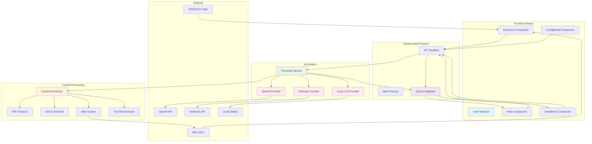

# AI Triage Assistant

A desktop application for triaging and classifying documents, URLs, and multimedia using local or remote LLMs.

## Architecture



## Features

- **Multi-format Support**: PDF, DOCX, TXT, URLs, YouTube videos
- **AI Analysis**: OpenAI, Anthropic, and local LLM support
- **Local Storage**: All data stored locally (SQLite)
- **Drag & Drop**: Easy file ingestion
- **Configurable**: Customizable system prompts and providers

## Getting Started

### Quick Start (Windows - Recommended)

1. **Install Dependencies**:
   ```cmd
   npm install
   ```

2. **Build the Application**:
   ```cmd
   npm run build
   ```

3. **Run the App**:
   ```cmd
   npx electron dist/main/src/main/main.js
   ```

### Development Setup (WSL2/Linux)

**Note**: Requires GUI libraries for Electron display.

1. **Install Dependencies**:
   ```bash
   npm install
   sudo apt install -y libnss3 libnspr4 libatk-bridge2.0-0 libdrm2 libxcomposite1 libxdamage1 libxrandr2 libgbm1 libxss1 libasound2
   ```

2. **Build and Run**:
   ```bash
   npm run build
   npm start
   ```

## Configuration

Before using the app, configure your LLM providers:

1. Click the "Config" button in the top-right
2. Set your system prompt (instructions for the AI)
3. Configure at least one provider:
   - **OpenAI**: Add your API key (use `gpt-4o` for large documents)
   - **Anthropic**: Add your API key (use `claude-3-haiku-20240307` or newer)
   - **Local LLM**: Set endpoint (e.g., `http://localhost:11434/api/generate` for Ollama)

## Usage

1. **Add Content**: 
   - Drag files into the drop zone
   - Click the drop zone to browse and select files
   - Enter URLs in the URL input field
2. **AI Analysis**: The app extracts content and gets AI recommendations ("Read" or "Discard")
3. **Review Results**: 
   - Browse the inbox with creation timestamps
   - Click items to view full details in the right pane
   - See extracted content, AI reasoning, and provider used
4. **Manage Items**:
   - Filter by All/Read/Discard in the inbox
   - Delete items with the × button
   - Reprocess items with different settings using the 🔄 button

## Supported Formats

- **Documents**: PDF, DOCX, TXT, Markdown
- **Web**: Any URL (extracts main content)
- **YouTube**: Video URLs (extracts title/description)

## Local LLM Setup

For Ollama:
```bash
# Install Ollama
curl -fsSL https://ollama.ai/install.sh | sh

# Pull a model
ollama pull llama2

# Start server (usually runs on localhost:11434)
ollama serve
```

Then configure the endpoint as `http://localhost:11434/api/generate` in the app.

## Building for Production

```bash
npm run build
npx electron dist/main/src/main/main.js
```

## Data Storage

The app stores all data locally in your OS user data directory:
- **Windows**: `%APPDATA%/reading_agent/`
- **macOS**: `~/Library/Application Support/reading_agent/`
- **Linux**: `~/.local/share/reading_agent/`

Database includes:
- Processed artifacts with extracted content
- AI recommendations and reasoning
- Configuration settings and provider credentials
- Processing timestamps (local time)

## Troubleshooting

### Large Document Issues
- Use GPT-4o instead of GPT-3.5-turbo for documents over ~8000 words
- Context length errors indicate the model can't handle the content size

### File Processing Issues  
- Supported: PDF, DOCX, TXT, MD files
- Drag-drop and file picker both supported
- Check console for extraction errors

### WSL2 Display Issues
```bash
# Install required libraries
sudo apt install -y libnss3 libnspr4 libatk-bridge2.0-0 libdrm2 libxcomposite1 libxdamage1 libxrandr2 libgbm1 libxss1 libasound2

# Or run on Windows instead (recommended)
```